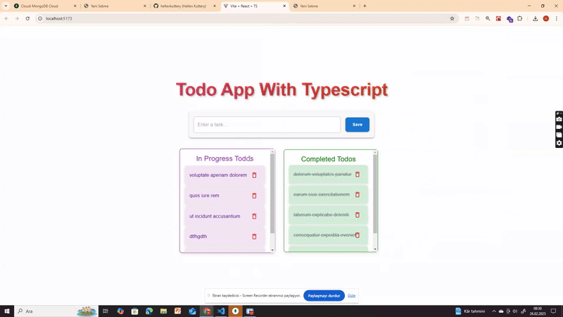

# Todo App

## Description
This project is a simple Todo Application built using TypeScript, React, and Material-UI. The application allows users to perform CRUD operations on their tasks, demonstrating the practical usage of TypeScript in a React environment. Users can add, update, mark tasks as completed, and delete tasks efficiently.

## Live Demo


## Problem Statement
The purpose of this project is to showcase how TypeScript can be effectively used in a React application for state management and API calls while maintaining type safety and scalability. The goal is to create a functional Todo App with different task states such as:

- **Pending** (Newly added tasks)
- **In Progress** (Tasks that are currently being worked on)
- **Completed** (Tasks that are marked as done)

## Features
### 1. Task Management
- Add new tasks with a title and description.
- Move tasks between different states (Pending → In Progress → Completed).
- Delete tasks when no longer needed.
- Persist tasks in local storage.

### 2. Task Status Updates
- Click on a task to change its state:
  - **Pending → In Progress**
  - **In Progress → Completed**
  - **Completed** tasks remain in the completed section.
- Delete tasks from any section.

### 3. UI and User Experience
- Responsive design using Material-UI.
- Smooth state transitions and user-friendly interactions.

## Expected Outcome
- A clean and functional UI for task management.
- CRUD operations (Create, Read, Update, Delete) implemented with TypeScript.
- Type safety with React and API calls using Axios.
- Proper state management for tasks and their transitions.

## Technologies Used
- **TypeScript**: Ensures type safety and better maintainability.
- **React**: Component-based UI for dynamic updates.
- **Material-UI**: Modern and responsive UI components.
- **Axios**: For handling API requests.
- **React Context API**: For global state management.

## Installation & Setup
To run this project locally, follow these steps:

1. Clone the repository:
   ```sh
   git clone https://github.com/yourusername/todo-app.git
   cd todo-app
   ```

2. Install dependencies:
   ```sh
   npm install
   ```

3. Start the development server:
   ```sh
   npm run dev
   ```

4. Open your browser and navigate to `http://localhost:5173` (or the port shown in your terminal).

## Project Structure
```
📂 src
 ┣ 📂 components
 ┃ ┣ 📜 Addtodo.tsx
 ┃ ┣ 📜 Header.tsx
 ┃ ┗ 📜 TodoItemList.tsx
 ┃ ┗ 📜 TodoList.tsx
 ┣ 📂 pages
 ┃ ┗ 📜 Home.tsx
 ┣ 📜 App.tsx
 ┣ 📜 main.tsx
```

This project serves as a practical example of how to implement a TypeScript-based CRUD application with React and Context API. 🚀

